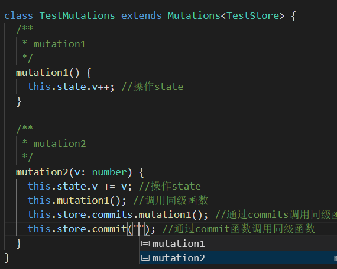

# vuex-cuer

### 简介
Vuex的 `commit` 和 `dispatch` 没有友好的提示，大项目难以维护。如何避免，使用 `vuex-cuer`
<br>

### 效果
1. 推荐直接通过`commits`调用函数，因为这样有能查看到原函数的注释<br><br>
<br>

2. 兼容`commit`函数调用，并且优化了提示<br><br>
<br>
<br>

### 使用
- 在 js （`es6`） 中使用：创建一个`test.store.js`文件
（请注意`jsdoc`注释的规范）
```javascript
/* eslint-disable no-unused-vars */
import * as Cuer from "../src/index";

const state = {
  /**
   * state.v
   */
  v: 1
};

/**
 * @extends Cuer.Mutations<TestCuer>
 */
class Mutations extends Cuer.Mutations {
  /**
   * test1
   */
  test1() {
    this.state.v++;
  }
}

/**
 * @extends Cuer.Actions<TestCuer>
 */
class Actions extends Cuer.Actions {
  /**
   * test2
   */
  test2() {
    this.state.v++;
    this.store.commits.test1();
    this.store.commit("test1");
  }
}

const getters = {
  /**
   * getters.v
   */
  v: () => 1
};

/**
 * @type { Cuer.StoreCuer<State,Mutations,Actions,Getters> }
 */
const cuer = new Cuer.StoreCuer(state, {
  mutations: new Mutations(),
  actions: new Actions(),
  getters
});

cuer.dispatchs.test2();
cuer.dispatch("test2");

export default cuer;

/**
 * @typedef { typeof state } State
 */
/**
 * @typedef { typeof getters } Getters
 */
/**
 * @typedef { typeof cuer } TestCuer
 */

```
<br>


- 在 ts 中使用：创建一个`test.store.ts`文件
```typescript
import * as Cuer from "../src/index";

const state = {
  /**
   * state.v
   */
  v: 1
};

class Mutations extends Cuer.Mutations<TestStore> {
  /**
   * mutation1
   */
  mutation1() {
    this.state.v++; //操作state
  }

  /**
   * mutation2
   */
  mutation2(v: number) {
    this.state.v += v; //操作state
    this.mutation1(); //调用同级函数
    this.store.commits.mutation1(); //通过commits调用同级函数
    this.store.commit("mutation1"); //通过commit函数调用同级函数
  }
}

class Actions extends Cuer.Actions<TestStore> {
  /**
   * action1
   */
  action1() {
    this.state.v++;
  }

  /**
   * action2
   */
  action2() {
    this.state.v++;
    this.action1();
    this.store.commits.mutation2(1);
    this.store.commit("mutation1");
    this.store.dispatch("test2");
  }
}

const getters = {
  /**
   * getters.v
   */
  v: () => 1
};

class TestStore extends Cuer.StoreCuer<
  typeof state,
  Mutations,
  Actions,
  typeof getters
> {
  constructor() {
    super(state, {
      mutations: new Mutations(),
      actions: new Actions(),
      getters
    });
  }
}

const store = new TestStore();

store.commits.mutation1(); //通过store调用

export default store;

```
<br>


- 如果没有 `mutations` 、 `actions` 或者 `getters` 如何继承
```typescript
class TestStore extends Cuer.StoreCuer<
  typeof state,
  Cuer.Empty,
  Cuer.Empty,
  Cuer.Empty
> {
  constructor() {
    super(state, {
    });
  }
}
```
<br>
